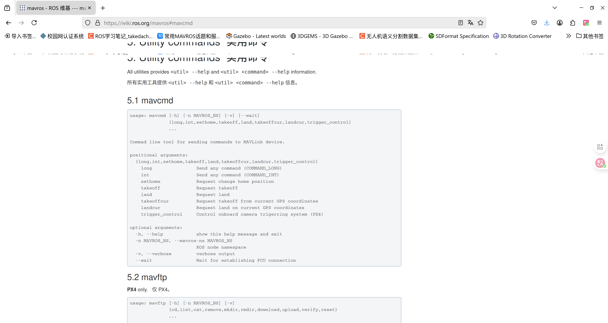
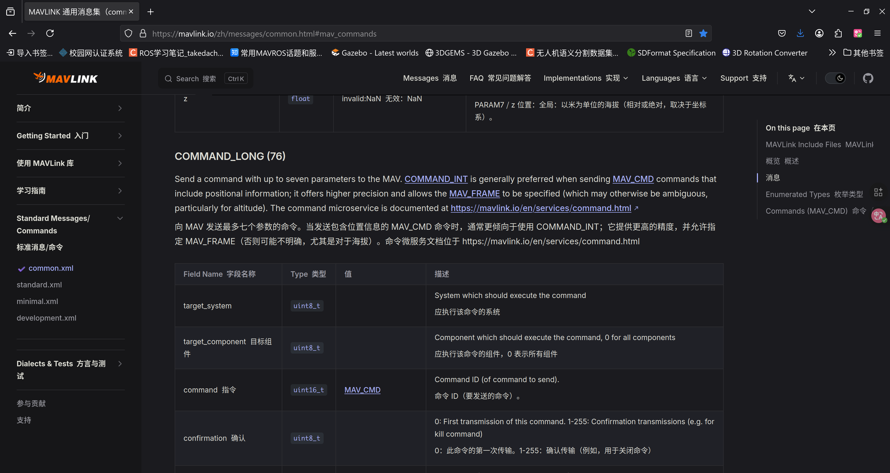
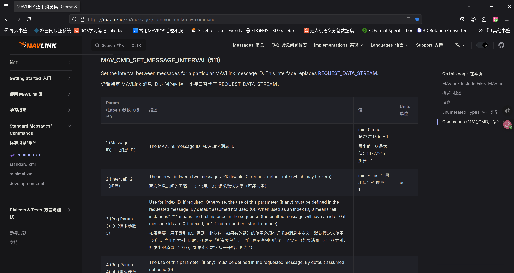
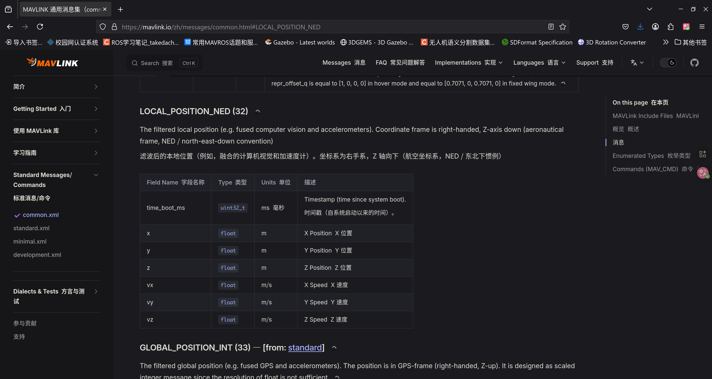
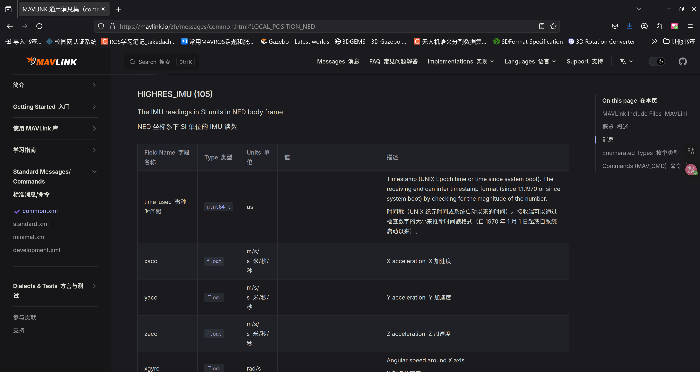

## 编程地更改MAVROS话题命令、发送MAVLink指令

> 作者：张子宇

在VINS等应用中，需要从飞控获取IMU、位姿等高频率数据，一般是通过订阅MAVROS的相关话题实现的。

有时我们需要更高频率的数据，这必须从飞控更改。有教程已经指出，可以通过配置飞控SD卡参数、配置飞控固件参数、在QGC的MAVLink Shell中输入命令等方法解决。

但上述方法都**不是通过编程手段解决的**，而引入了其他不必要的环节，使我们在启动主程序之前不得不做一些额外的工作。

如何编程化地解决上述问题呢？

### 底层原理

MAVROS实际上是一种“**包装器**”(wrapper)，它**将飞控发送的MAVLink消息包装成了ROS话题/服务**发布。

因此：
- MAVROS能够发布/接收何种类型的话题，取决于MAVLink协议支持什么样的消息；
- MAVROS能够向飞控发送什么样的指令（解锁/上锁/切换模式），取决于MAVLink协议定义了什么样的指令。
- MAVROS话题发布的频率如何，取决于MAVLink流发送原始数据的频率如何。

MAVLink协议定义了什么数据和指令，可以查看[官方网站](https://mavlink.io/zh/messages/common.html#mav_commands)。

在QGC的监测页面（左上角按钮 -> Analyze Tools -> MAVLink监测）中可以看到MAVLink消息的频率，高版本（v5.0以上，很遗憾Ubuntu 20.04不支持）的QGC还能够直接更改。

### 具体实现

根据上述原理，我们可以想到：既然QGC能够提高MAVLink消息频率，且QGC是通过MAVLink协议本身与PX4通信的，那么我们应该也有程序化的办法发送相同的指令。

阅读[MAVROS的官方wiki](https://wiki.ros.org/mavros)可以发现，MAVROS将**发送MAVLink指令消息**包装为了一个**ROS服务**：`/mavros/cmd/command`。
> 这就像把 MAVLink数据 包装成 ROS话题 一样。

这是一个`mavros_msgs::CommandLong`类型的服务，定义如下：


事实上它对应如下的MAVLink消息：


换句话说，给MAVLink的这个消息字段中填充适当的指令，即可指令飞控完成相应任务。

那它有哪些指令可供发送呢？再查阅[MAVLink的官方网站](https://mavlink.io/zh/messages/common.html#mav_commands)，可以发现如下指令的定义：



这就是我们所需的511号指令了，它可以设定MAVLink消息的频率（而我们已经知道，MAVROS话题的频率是取决于对应消息的频率的）。

通过查阅官方网站，或者在QGC上查看消息对应的id，可以找到：

> 32号消息，本地坐标系位置，对应`/mavros/local`系列话题


> 105号消息，IMU读数，对应`/mavros/imu_data`系列话题


于是，511号指令的所有参数（其实就2个参数，ID和间隔）已经齐全，只需要请求服务即可。

C++实现代码如下：
```cpp
/***
展示如何在主程序中发送提高话题频率的 **代码片段** 。
使用时，只需要包含必要的头文件，然后插入到任何你需要的地方即可。
***/

#include <ros/ros.h>
#include <mavros_msgs/CommandLong.h>

cmd_client_ = nh_.serviceClient<mavros_msgs::CommandLong>("/mavros/cmd/command");
cmd_client_.waitForExistence(ros::Duration(3.0));
mavros_msgs::CommandLong cmd_msg;
cmd_msg.request.broadcast = false;                      // 不广播
cmd_msg.request.confirmation = false;                   // 不需要确认
cmd_msg.request.command = 511;                          // MAV_CMD_SET_MESSAGE_INTERVAL（设定特定MAVLink消息）
cmd_msg.request.param1 = 32;                            // 参数1：LOCAL_POSITION_NED （局部位置消息ID：32）
// 若设定IMU频率，则cmd_msg.request.command = 105; 
double hz = 50.0;
cmd_msg.request.param2 = 1000000.0 / hz;                // 参数2：频率50Hz
cmd_client_.call(cmd_msg);
ROS_INFO_ONCE("已请求提高消息发布频率至50Hz。");
```
你可以复制到你代码的任何部分（例如程序的初始化阶段），这样就再也不会忘记提高IMU频率了。